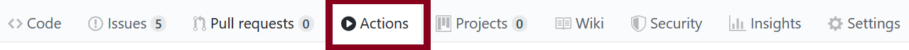

# Project Template

This repository is your starting point for your project. Please look through all these materials so you know how to organize your project.

Link to your GitHub pages website: `[insert your *clickable* hyperlink here]`

# Aim of the assignment

This assignment will make sure you and your group memebers are all set up correctly with a project repo.
Moreover, it gives you a good and consistent starting point to begin coding.

# Instructions

Please look through **all** the materials below so you understand the setup instructions; how to run, organize, and submit your code; and our requirements for the visualization.

## Setup

**Under no circumstances should you be editing files via the GitHub website user interface.** Do all your edits locally after cloning the repository. Commit major versions to your git repository.

1. Clone this repository to your local machine.
    E.g., in your terminal / command prompt `CD` to where you want this the folder for this activity to be. Then run `git clone <YOUR_REPO_URL>`

1. `CD` or open a terminal / command prompt window into the cloned folder.

1. Start a simple python webserver. E.g., `python -m http.server`, `python3 -m http.server`, or `py -m http.server`. If you are using python 2 you will need to use `python -m SimpleHTTPServer` instead, but please switch to python 3 as [Python 2 was sunset on 2020-01-01](https://www.python.org/doc/sunset-python-2/).

1. Wait for the output: `Serving HTTP on 0.0.0.0 port 8000 (http://0.0.0.0:8000/)`.

1. Now open your web browser (Firefox or Chrome) and navigate to the URL: http://localhost:8000

## Update hyperlinks

1. Edit near the top of this `README.md` file to include a clickable hyperlink to the GitHub pages website for your repo., replacing the `` `[insert your *clickable* hyperlink here]` `` code with your markdown. (Detailed instructions for GitHub pages [here](https://developer.mozilla.org/en-US/docs/Learn/Common_questions/Using_Github_pages).)

1. In `index.html` update the GitHub repo URL with the URL of your repository. It is in the span with `id='forkongithub'`.

## Add hyperlink to your paper draft

1. **Add a clickable hyperlink to your GitHub Classroom-generated repository at the end of the Abstract in your paper draft.**

## Organization

Here is an overview of the files and folders we provide for you in your repo.

### Root Files

* `README.md` is this explanatory file for the repo.

* `index.html` contains the main website content. It includes comments surrounded by `<!--` and `-->` to help guide you through making your edits.

* `style.css` contains the CSS.

* `LICENCE` is the source code license for the template. You can add your name or leave it as is.

### Folders

Each folder has an explanatory `README.md` file.

* `data` is where you will put your data files.

* `favicons` contains the favicons for the web page. You shouldn't change anything here.

* `.github` contains [GitHub Actions](https://github.com/features/actions) ([docs](https://docs.github.com/en/actions)) which will automatically validate your HTML, CSS, and hyperlinks when you push (see the [**validation last step** below](#validated)). **Do not edit files here** except to create new `.yml` files for any additional actions you choose to add (you are not required to make any).

* `files` will contain your slides (PDF) and video (MP4).

* `img` will contain your screenshots, diagrams, and photos.

* `js` will contain all JavaScript files you write.

  * `visualization.js` is the main code that builds all your visualizations. Each visualization should be built following the [Reusable Chart model](https://bost.ocks.org/mike/chart/), ideally with a separate .js file for each one.

* `lib` will contain any JavaScript library you use. It currently includes D3. To ensure long-term survivability, **use the included D3 here rather than linking to [d3js.org](https://d3js.org) or some other CDN.** Likewise, put your other libraries here rather than loading them from elsewhere.

## Software license

1. Review the license for your project in `LICENSE`. The default license we include in the template `LICENCE` file is the open source [3-Clause BSD License](https://opensource.org/licenses/BSD-3-Clause). You are not required to make your project open source but it is preferred and enables easier adoption of your contributions by others. 
   
1. Add your names to `LICENCE`.
If you make any changes to your license other than including your names that are not approved by the teaching staff, you will need to sign a [Non-exclusive Right to Use and Modify Agreement](https://www.ccs.neu.edu/home/cody/courses/shared/S-L_project_partner_usage_agreement.pdf) so your project partner can actually use what you’ve made.

## Implement your visualizations

The first assignment using this template — and subsequent ones — will ask you to implement your visualizations. Please refer to the assignment instructions on Canvas for more details. However, for all your development follow these guidelines:

1. <a name='validated'></a> Ensure your code passes the 'Validate HTML, CSS, and Links' checks we run when you push to GitHub. I.e., you want to see a green check next to your commit
  (<svg width='16' height='16' role='img'><path stroke='#22863a' d='M13.78 4.22a.75.75 0 010 1.06l-7.25 7.25a.75.75 0 01-1.06 0L2.22 9.28a.75.75 0 011.06-1.06L6 10.94l6.72-6.72a.75.75 0 011.06 0z'></path></svg>)
  and not a red X
  (<svg width='16' height='16' role='img'><path stroke='#cb2431' d='M3.72 3.72a.75.75 0 011.06 0L8 6.94l3.22-3.22a.75.75 0 111.06 1.06L9.06 8l3.22 3.22a.75.75 0 11-1.06 1.06L8 9.06l-3.22 3.22a.75.75 0 01-1.06-1.06L6.94 8 3.72 4.78a.75.75 0 010-1.06z'></path></svg>).
You can also see the results in the Actions tab of your repo:


1. Note that you do not need to commit to test your code. E.g., you don’t need to deploy your GitHub page to see your changes as you make them. Instead, serve the web page out of your repo folder using your terminal and Python's `http.server`.

1. Don't commit private/confidential data.

# Academic integrity

You are welcome to use D3 tutorials or resources as a starting point for your code.
However, **you must cite and reference the resources or sample code you use and explain how you use them**.
***This includes anything from [bl.ocks.org](https://bl.ocks.org/), [Observable](https://observablehq.com/@d3/gallery), or [Stack Overflow](https://stackoverflow.com/)!***
Failure to properly cite and attribute code is a breach of academic honesty.
Also, per our syllabus, homework is an individual assessment and should be completed by you alone.
Simply copying existing examples without performing thoughtful edits is a breach of academic honesty.
You are welcome to ask fellow classmates and students for help and discuss the assignment, but **the submission should be your own work**.
***See [the syllabus](https://northeastern.instructure.com/courses/18721) for much more detail on our academic integrity policy and expectations.***

# Submission instructions

This template will be used for multiple project submissions. Follow the instructions for submitting each on Canvas. But for all of them:

1. Ensure you updated (1) the GitHub Pages URL at the top of this `README.md` file and (2) the GitHub repository URL in `index.html` in the span with `id='forkongithub'`.

2. Commit all your local files and push them to the remote repository on GitHub which was generated by GitHub Classroom. We will grade based on what is visible on the GitHub Page.

3. **Add links to your GitHub Classroom-generated repository (not your GitHub Page) at the end of the Abstract in your paper draft.**

# Tips, tricks, and troubleshooting

See https://github.com/NEU-DS-4200-F20-Staff/General_Course_Information/blob/master/d3.md

## Workflow

As you work with your team, you may have issues merging your changes. We recommend you pick one member of the team to be the project manager and deal with merging any pull requests.

Instead of all working directly out of the main `gh-pages` branch, you can try adopting a Git branching model for development. See, e.g., [this article by Vincent Driessen](https://nvie.com/posts/a-successful-git-branching-model/) and the included image:


## Resources

### How to send selection updated events between linked views

The d3-dispatch module [`d3-dispatch`](https://github.com/d3/d3-dispatch) is made for emiting and listening for events, which we can use to coordinate selection updates between linked views.

E.g.,

```js
let dispatcher = d3.dispatch('selectionUpdated');
dispatcher.on('selectionUpdated', callback1);
```

where `callback1` is a callback function for when the event happens.
However, to have multiple listeners for that same event you would need to have unique suffixes for the same string beginning with '`.`'.
E.g., to have both a line chart and table listening to scatterplot updates we could have

```js
dispatcher.on('selectionUpdated.sp-to-lc', callback1);
dispatcher.on('selectionUpdated.sp-to-tab', callback1);
```

where `'sp-to-lc'` and `'sp-to-tab'` are arbitrary but written here to be informative.

# Assignment setup (for instructors only)

See https://github.com/NEU-DS-4200-F20-Staff/General_Course_Information/blob/master/assignment-setup.md